# Entity Relationship Diagram (ERD) - ERP Stock PIMDAI

## ภาพรวมการออกแบบฐานข้อมูล

เอกสารนี้แสดงโครงสร้างฐานข้อมูลสำหรับระบบ ERP Stock PIMDAI ซึ่งประกอบด้วย **38 ตาราง** หลัก แบ่งออกเป็น 8 กลุ่มหลัก ตามโมดูลการทำงาน

**จุดเด่นของการออกแบบ:**
- ✅ รองรับ **Soft Delete** ด้วยฟิลด์ `deleted_at` ในตาราง Master Data
- ✅ ออกแบบตามหลัก **3NF** เพื่อลดความซ้ำซ้อน
- ✅ มี **Audit Trail** ครบถ้วนด้วย `created_at`, `updated_at`, และ `deleted_at`
- ✅ รองรับ **Multi-Warehouse** และ **Multi-Location**
- ✅ ระบบคำนวณ **ค่าเสื่อมราคาอัตโนมัติ**
- ✅ แบ่ง**สินค้า 2 ประเภท**: Finished Goods (ปรับได้โดยตรง) และ Raw Materials (ผ่าน Stock In/Out)
- ✅ รองรับบทบาท **ฝ่ายการตลาด (Marketing)**

---

## 📊 ERD Diagram

```mermaid
erDiagram
    %% ==================== CORE ENTITIES ====================
    Users ||--o{ Quotations : creates
    Users ||--o{ Invoices : creates
    Users ||--o{ PurchaseOrders : creates
    Users ||--o{ Attendance : records
    Users ||--o{ Expenses : submits
    
    Users {
        int id PK
        string username
        string password_hash
        string full_name
        string email
        string phone
        enum role "Admin, Sales, Inventory, Purchase, Accountant, Marketing"
        boolean is_active
        datetime created_at
        datetime updated_at
        datetime deleted_at
    }
    
    %% ==================== CRM ENTITIES ====================
    Customers ||--o{ Quotations : receives
    Customers ||--o{ Invoices : "billed to"
    Customers ||--o{ SurveyCalls : "surveyed for"
    Customers ||--o{ Claims : files
    
    Customers {
        int id PK
        string customer_code UK
        string company_name
        string tax_id
        string contact_person
        string phone
        string email
        string address
        string district
        string province
        string postal_code
        enum customer_type "Individual, Corporate"
        decimal credit_limit
        int payment_term_days
        datetime created_at
        datetime updated_at
        datetime deleted_at
    }
    
    %% ==================== SALES ENTITIES ====================
    Quotations ||--o{ QuotationItems : contains
    Quotations ||--o| Billings : "converts to"
    
    Quotations {
        int id PK
        string quotation_no UK
        int customer_id FK
        int user_id FK
        date quotation_date
        date valid_until
        decimal subtotal
        decimal discount_percent
        decimal discount_amount
        decimal tax_percent
        decimal tax_amount
        decimal grand_total
        enum status "Draft, Sent, Approved, Rejected, Converted"
        text notes
        datetime created_at
        datetime updated_at
    }
    
    QuotationItems ||--|| Products : references
    
    QuotationItems {
        int id PK
        int quotation_id FK
        int product_id FK
        string product_name
        int quantity
        decimal unit_price
        decimal discount_percent
        decimal total_amount
        text remarks
    }
    
    Billings ||--o{ BillingItems : contains
    Billings ||--o| Invoices : "converts to"
    
    Billings {
        int id PK
        string billing_no UK
        int quotation_id FK
        int customer_id FK
        date billing_date
        decimal subtotal
        decimal tax_amount
        decimal grand_total
        enum status "Pending, Delivered, Invoiced"
        text delivery_address
        datetime created_at
        datetime updated_at
    }
    
    BillingItems ||--|| Products : references
    
    BillingItems {
        int id PK
        int billing_id FK
        int product_id FK
        string product_name
        int quantity
        decimal unit_price
        decimal total_amount
    }
    
    Invoices ||--o{ InvoiceItems : contains
    Invoices ||--o{ Payments : "paid by"
    
    Invoices {
        int id PK
        string invoice_no UK
        int billing_id FK
        int customer_id FK
        date invoice_date
        date due_date
        decimal subtotal
        decimal tax_amount
        decimal grand_total
        decimal paid_amount
        decimal balance
        enum status "Unpaid, Partial, Paid, Overdue"
        datetime created_at
        datetime updated_at
    }
    
    InvoiceItems ||--|| Products : references
    
    InvoiceItems {
        int id PK
        int invoice_id FK
        int product_id FK
        string product_name
        int quantity
        decimal unit_price
        decimal total_amount
    }
    
    Payments {
        int id PK
        string payment_no UK
        int invoice_id FK
        date payment_date
        decimal amount
        enum payment_method "Cash, Transfer, Cheque, Credit"
        string reference_no
        text notes
        datetime created_at
    }
    
    %% ==================== AFTER SALES ====================
    SurveyCalls {
        int id PK
        int customer_id FK
        int user_id FK
        date survey_date
        int satisfaction_score
        text feedback
        text action_taken
        datetime created_at
    }
    
    Claims ||--|| Products : "claims for"
    
    Claims {
        int id PK
        string claim_no UK
        int customer_id FK
        int product_id FK
        date claim_date
        enum claim_type "Warranty, Defect, Damage"
        text description
        enum status "Open, InProgress, Resolved, Closed"
        text resolution
        date resolved_date
        datetime created_at
    }
    
    ExtraDuties {
        int id PK
        string duty_no UK
        int customer_id FK
        int user_id FK
        date duty_date
        string duty_type
        text description
        decimal charge_amount
        enum status "Pending, Completed, Billed"
        datetime created_at
    }
    
    %% ==================== SUPPLIER & PURCHASE ====================
    Suppliers ||--o{ PurchaseOrders : "supplies to"
    
    Suppliers {
        int id PK
        string supplier_code UK
        string company_name
        string tax_id
        string contact_person
        string phone
        string email
        string address
        int payment_term_days
        decimal credit_limit
        datetime created_at
        datetime updated_at
        datetime deleted_at
    }
    
    PurchaseOrders ||--o{ PurchaseOrderItems : contains
    PurchaseOrders ||--o{ StockIns : "received as"
    
    PurchaseOrders {
        int id PK
        string po_no UK
        int supplier_id FK
        int user_id FK
        date order_date
        date expected_date
        decimal subtotal
        decimal tax_amount
        decimal grand_total
        enum status "Draft, Sent, Confirmed, Received, Cancelled"
        datetime created_at
        datetime updated_at
    }
    
    PurchaseOrderItems ||--|| Products : orders
    
    PurchaseOrderItems {
        int id PK
        int purchase_order_id FK
        int product_id FK
        int quantity_ordered
        int quantity_received
        decimal unit_price
        decimal total_amount
    }
    
    %% ==================== INVENTORY ENTITIES ====================
    Products ||--o{ StockMovements : tracks
    Products }o--|| ProductCategories : "belongs to"
    
    Products {
        int id PK
        string product_code UK
        string product_name
        int category_id FK
        enum product_type "Finished Goods, Raw Materials"
        string barcode
        text description
        string unit "Piece, Box, Kg, Liter"
        decimal cost_price
        decimal selling_price
        int reorder_level
        int current_stock
        boolean is_active
        datetime created_at
        datetime updated_at
        datetime deleted_at
    }
    
    ProductCategories {
        int id PK
        string category_code UK
        string category_name
        text description
        datetime created_at
        datetime deleted_at
    }
    
    Warehouses ||--o{ StockMovements : records
    
    Warehouses {
        int id PK
        string warehouse_code UK
        string warehouse_name
        string location
        string manager_name
        boolean is_active
        datetime created_at
        datetime deleted_at
    }
    
    StockMovements {
        int id PK
        string movement_no UK
        int product_id FK
        int warehouse_id FK
        enum movement_type "IN, OUT, ADJUSTMENT"
        int quantity
        decimal unit_cost
        string reference_type "PO, Sale, Adjustment"
        int reference_id
        date movement_date
        int user_id FK
        text remarks
        datetime created_at
    }
    
    StockIns ||--o{ StockInItems : contains
    
    StockIns {
        int id PK
        string stock_in_no UK
        int warehouse_id FK
        int purchase_order_id FK
        date received_date
        int received_by FK
        text remarks
        datetime created_at
    }
    
    StockInItems ||--|| Products : receives
    
    StockInItems {
        int id PK
        int stock_in_id FK
        int product_id FK
        int quantity
        decimal unit_cost
    }
    
    StockOuts ||--o{ StockOutItems : contains
    
    StockOuts {
        int id PK
        string stock_out_no UK
        int warehouse_id FK
        int billing_id FK
        date issued_date
        int issued_by FK
        text remarks
        datetime created_at
    }
    
    StockOutItems ||--|| Products : issues
    
    StockOutItems {
        int id PK
        int stock_out_id FK
        int product_id FK
        int quantity
    }
    
    StockAdjustments ||--o{ StockAdjustmentItems : contains
    
    StockAdjustments {
        int id PK
        string adjustment_no UK
        int warehouse_id FK
        date adjustment_date
        enum reason "Damage, Lost, Found, Recount"
        int adjusted_by FK
        text remarks
        datetime created_at
    }
    
    StockAdjustmentItems ||--|| Products : adjusts
    
    StockAdjustmentItems {
        int id PK
        int adjustment_id FK
        int product_id FK
        int quantity_before
        int quantity_after
        int quantity_change
    }
    
    %% ==================== ACCOUNTING & ASSETS ====================
    Assets }o--|| AssetCategories : "categorized as"
    Assets ||--o{ Depreciations : "depreciates via"
    
    AssetCategories {
        int id PK
        string category_code UK
        string category_name
        decimal depreciation_rate
        int useful_life_years
        datetime created_at
        datetime deleted_at
    }
    
    Assets {
        int id PK
        string asset_code UK
        string asset_name
        int category_id FK
        date purchase_date
        decimal purchase_cost
        decimal salvage_value
        decimal accumulated_depreciation
        decimal book_value
        string location
        enum status "Active, Disposed, Sold"
        datetime created_at
        datetime updated_at
        datetime deleted_at
    }
    
    Depreciations {
        int id PK
        int asset_id FK
        int period_year
        int period_month
        decimal depreciation_amount
        decimal accumulated_depreciation
        decimal book_value
        datetime created_at
    }
    
    Expenses }o--|| ExpenseCategories : "categorized as"
    
    ExpenseCategories {
        int id PK
        string category_code UK
        string category_name
        datetime created_at
        datetime deleted_at
    }
    
    Expenses {
        int id PK
        string expense_no UK
        int category_id FK
        int user_id FK
        date expense_date
        decimal amount
        string vendor_name
        text description
        string receipt_no
        enum status "Pending, Approved, Rejected, Paid"
        datetime created_at
    }
    
    WithholdingTaxes {
        int id PK
        string wht_no UK
        int supplier_id FK
        date payment_date
        decimal payment_amount
        decimal tax_rate
        decimal tax_amount
        enum tax_type "Service, Rent, Professional"
        datetime created_at
    }
    
    %% ==================== HR & MARKETING ====================
    Attendance {
        int id PK
        int user_id FK
        date attendance_date
        time check_in
        time check_out
        decimal work_hours
        enum status "Present, Late, Absent, Leave"
        text remarks
        datetime created_at
    }
    
    MarketingLogs ||--o| Customers : "targets potential"
    
    MarketingLogs {
        int id PK
        string campaign_name
        enum channel "Facebook, Google, Email, Phone, Event"
        date campaign_date
        int customer_id FK
        text message
        enum response "Interested, NotInterested, NeedFollowup"
        decimal cost
        int user_id FK
        datetime created_at
    }
```



---

## 🗂️ กลุ่มตารางข้อมูล (Database Table Groups)

### 1. 👤 Core Entities (ตารางหลัก)
| ตาราง | คำอธิบาย | จำนวนฟิลด์ |
|-------|----------|-----------|
| **Users** | ข้อมูลผู้ใช้งานระบบและสิทธิ์การเข้าถึง | 10 |

**หมายเหตุ:** ตาราง Users เชื่อมโยงกับเกือบทุกโมดูลเพื่อระบุผู้สร้างหรือผู้รับผิดชอบ และมี `deleted_at` สำหรับ soft delete

---

### 2. 🤝 CRM & Customer Management (การจัดการลูกค้า)
| ตาราง | คำอธิบาย | จำนวนฟิลด์ |
|-------|----------|-----------|
| **Customers** | ข้อมูลลูกค้าทั้งบุคคลและนิติบุคคล | 15 |

**ฟีเจอร์เด่น:**
- รองรับทั้งลูกค้าบุคคลธรรมดาและนิติบุคคล
- มีระบบวงเงินเครดิตและเครดิตเทอม
- รองรับ soft delete เพื่อเก็บประวัติลูกค้าเก่า

---

### 3. 💰 Sales Module (โมดูลงานขาย)
| ตาราง | คำอธิบาย | จำนวนฟิลด์ |
|-------|----------|-----------|
| **Quotations** | เอกสารใบเสนอราคา | 13 |
| **QuotationItems** | รายการสินค้าในใบเสนอราคา | 7 |
| **Billings** | ใบส่งสินค้า/ใบวางบิล | 10 |
| **BillingItems** | รายการสินค้าที่ส่งมอบ | 6 |
| **Invoices** | ใบกำกับภาษี/ใบเสร็จรับเงิน | 12 |
| **InvoiceItems** | รายการสินค้าในใบกำกับภาษี | 6 |
| **Payments** | ประวัติการรับชำระเงิน | 7 |

**Flow ของเอกสาร:**
```
Quotation → Billing → Invoice → Payment
```

**ฟีเจอร์เด่น:**
- การแปลงเอกสารอัตโนมัติ (Quotation → Billing → Invoice)
- ระบบติดตามสถานะการชำระเงิน (Unpaid, Partial, Paid, Overdue)
- รองรับส่วนลดทั้งในระดับรายการและเอกสาร

---

### 4. 🔧 After-Sales Service (บริการหลังการขาย)
| ตาราง | คำอธิบาย | จำนวนฟิลด์ |
|-------|----------|-----------|
| **SurveyCalls** | บันทึกการโทรติดตามความพึงพอใจ | 6 |
| **Claims** | การเคลมสินค้าและการซ่อม | 10 |
| **ExtraDuties** | งานบริการพิเศษนอกเหนือจากการขายปกติ | 8 |

**ฟีเจอร์เด่น:**
- ระบบติดตามเคลมสินค้าตั้งแต่เปิดเรื่องจนปิดเคส
- บันทึกคะแนนความพึงพอใจของลูกค้า

---

### 5. 🏭 Purchase & Supplier Management (จัดซื้อและซัพพลายเออร์)
| ตาราง | คำอธิบาย | จำนวนฟิลด์ |
|-------|----------|-----------|
| **Suppliers** | ข้อมูลคู่ค้าและซัพพลายเออร์ | 11 |
| **PurchaseOrders** | ใบสั่งซื้อสินค้า | 10 |
| **PurchaseOrderItems** | รายการสินค้าในใบสั่งซื้อ | 6 |

**ฟีเจอร์เด่น:**
- ติดตามสินค้าที่สั่งซื้อแล้วแต่ยังไม่ได้รับ (Pending Orders)
- เปรียบเทียบ quantity_ordered vs quantity_received
- Suppliers มี soft delete เพื่อเก็บประวัติคู่ค้าเก่า

---

### 6. 📦 Inventory Management (การจัดการคลังสินค้า)
| ตาราง | คำอธิบาย | จำนวนฟิลด์ |
|-------|----------|-----------|
| **Products** | ข้อมูลสินค้าและรหัสสินค้า | 15 |
| **ProductCategories** | หมวดหมู่สินค้า | 5 |
| **Warehouses** | คลังสินค้าและจุดจัดเก็บ | 7 |
| **StockMovements** | ประวัติการเคลื่อนไหวสต็อก (Master Log) | 10 |
| **StockIns** | ใบรับวัตถุดิบเข้าคลัง | 6 |
| **StockInItems** | รายการวัตถุดิบที่รับเข้า | 4 |
| **StockOuts** | ใบเบิกวัตถุดิบออกจากคลัง | 6 |
| **StockOutItems** | รายการวัตถุดิบที่เบิกออก | 3 |
| **StockAdjustments** | ใบปรับปรุงสต็อก | 6 |
| **StockAdjustmentItems** | รายการปรับสต็อก | 5 |

**ฟีเจอร์เด่น:**
- **สินค้า 2 ประเภท:** แบ่งเป็นสินค้าสำเร็จรูป (Finished Goods) และวัตถุดิบ (Raw Materials)
- **สินค้าสำเร็จรูป:** สามารถเพิ่ม/ลดสต็อกได้โดยตรงผ่านระบบจัดการสินค้า (Quick Stock Update)
- **วัตถุดิบ:** จัดการผ่าน Stock In/Out พร้อมบันทึกต้นทุนและการใช้งาน
- **StockMovements** เป็นตารางหลักที่บันทึกการเคลื่อนไหวทั้งหมด (Audit Trail)
- รองรับหลายคลังสินค้า (Multi-Warehouse)
- ระบบแจ้งเตือนสินค้าใกล้หมด (Reorder Level)
- ติดตาม Cost Price และ Selling Price แยกกัน
- Products, ProductCategories, และ Warehouses มี soft delete

---

### 7. 💼 Accounting & Asset Management (บัญชีและสินทรัพย์)
| ตาราง | คำอธิบาย | จำนวนฟิลด์ |
|-------|----------|-----------|
| **Assets** | ทรัพย์สินขององค์กร | 11 |
| **AssetCategories** | หมวดหมู่สินทรัพย์พร้อมอัตราค่าเสื่อม | 6 |
| **Depreciations** | บันทึกค่าเสื่อมราคารายเดือน | 6 |
| **Expenses** | ค่าใช้จ่ายและการเบิกจ่าย | 10 |
| **ExpenseCategories** | หมวดหมู่ค่าใช้จ่าย | 4 |
| **WithholdingTaxes** | ภาษีหัก ณ ที่จ่าย | 7 |

**ฟีเจอร์เด่น:**
- **ระบบคำนวณค่าเสื่อมราคาอัตโนมัติ** ตามวิธีเส้นตรง
- ติดตาม Book Value แบบเรียลไทม์
- รองรับการจัดการภาษีหัก ณ ที่จ่ายตามประเภท
- Assets และ Categories มี soft delete เพื่อรักษาประวัติค่าเสื่อมราคา

---

### 8. 📊 HR & Marketing (ทรัพยากรบุคคลและการตลาด)
| ตาราง | คำอธิบาย | จำนวนฟิลด์ |
|-------|----------|-----------|
| **Attendance** | บันทึกการเข้า-ออกงาน | 7 |
| **MarketingLogs** | บันทึกกิจกรรมทางการตลาด | 9 |

**ฟีเจอร์เด่น:**
- คำนวณชั่วโมงการทำงานอัตโนมัติ
- ติดตาม ROI ของแคมเปญการตลาดผ่าน cost และ response

---

## 🔗 ความสัมพันธ์สำคัญ (Key Relationships)

### Sales Flow (ขายสินค้า)
```
Customer → Quotation → Billing → Invoice → Payment
              ↓           ↓
         QuotationItems  BillingItems → StockOut → StockMovements
```

### Purchase Flow (ชื้อวัตถุดิบ)
```
Supplier → PurchaseOrder → StockIn (Raw Materials) → StockMovements
                ↓            ↓
        PurchaseOrderItems  StockInItems
```

### Inventory Update Flow
```
# สำหรับสินค้าสำเร็จรูป (Finished Goods)
Direct Update: Product.current_stock → StockMovements (log)

# สำหรับวัตถุดิป (Raw Materials)  
Stock In/Out: StockIns/StockOuts → StockMovements → Product.current_stock
```

### Asset Management Flow
```
AssetCategory → Asset → Depreciation (monthly)
```

---

## 📌 หลักการออกแบบ (Design Principles)

1. **Normalization:** ออกแบบตาม 3NF เพื่อลดความซ้ำซ้อนของข้อมูล
2. **Audit Trail:** ทุกตารางมี `created_at` และ `updated_at` เพื่อติดตามประวัติการสร้างและแก้ไข
3. **Soft Delete Strategy:** ใช้ `deleted_at` (datetime nullable) สำหรับการลบข้อมูลแบบ soft delete โดยไม่ลบข้อมูลจริงออกจากฐานข้อมูล มีผลกับ:
   - **Master Data Tables:** Users, Customers, Suppliers, Products, ProductCategories, Warehouses
   - **Configuration Tables:** Assets, AssetCategories, ExpenseCategories
   - **หมายเหตุ:** Transaction Tables (Quotations, Invoices, Payments, StockMovements ฯลฯ) จะไม่ใช้ soft delete เนื่องจากเป็น historical records ที่ต้องเก็บไว้ตลอดเพื่อการ audit และใช้ `status` ในการควบคุมสถานะแทน
4. **Foreign Key Constraints:** ทุกความสัมพันธ์มี FK เพื่อความสมบูรณ์ของข้อมูล พร้อมกำหนด `ON DELETE RESTRICT` เพื่อป้องกันการลบข้อมูลที่มี dependency
5. **Unique Constraints:** ใช้ `UK` สำหรับรหัสเอกสารและรหัสอ้างอิงต่างๆ เพื่อป้องกันความซ้ำซ้อน
6. **Decimal Precision:** ใช้ DECIMAL(10,2) สำหรับข้อมูลการเงินเพื่อความแม่นยำในการคำนวณ

---

## �️ Soft Delete Implementation
### ประเภทสินค้าและการจัดการสต็อก (Product Types & Stock Management)

ระบบแบ่งสินค้าออกเป็น 2 ประเภทหลัก:

#### 1. 🏭 Finished Goods (สินค้าสำเร็จรูป)
**การใช้งาน:**
- สินค้าที่พร้อมขายให้ลูกค้า
- สามารถปรับจำนวนสต็อกได้โดยตรงผ่านระบบจัดการสินค้า
- เหมาะสำหรับธุรกิจค้าส่ง-ค้าปลีก

**วิธีการอัปเดตสต็อก:**
- **Quick Update:** เพิ่ม/ลดจำนวนโดยตรงจากหน้าจัดการสินค้า
- **Stock Adjustment:** ปรับยอดคงเหลือเมื่อนับสต็อกจริง
- **Auto Update:** ระบบจะลดสต็อกอัตโนมัติเมื่อขายสินค้า (Billing/Invoice)

**ตัวอย่าง:** เสื้อผ้าสำเร็จรูป, อุปกรณ์อิเล็กทรอนิกส์, สินค้า FMCG

#### 2. 🔧 Raw Materials (วัตถุดิบ)
**การใช้งาน:**
- วัตถุดิบสำหรับใช้ในการผลิตหรือประกอบ
- ต้องบันทึกการเข้า-ออกผ่านเอกสาร Stock In/Out
- มีการติดตามต้นทุนต่อหน่วยอย่างละเอียด

**วิธีการอัปเดตสต็อก:**
- **Stock In:** รับวัตถุดิบเข้าคลัง (พร้อมบันทึกต้นทุน)
- **Stock Out:** เบิกวัตถุดิบออกไปใช้ในการผลิต
- **Stock Adjustment:** ปรับยอดเมื่อมีความคลาดเคลื่อน

**ตัวอย่าง:** ผ้าม้วน, วัสดุก่อสร้าง, อะไหล่ชิ้นส่วน

**การบันทึกข้อมูล:**
```
Finished Goods Flow:
Product Update → current_stock ± quantity → Log to StockMovements

Raw Materials Flow:
StockIn/StockOut Document → StockInItems/StockOutItems → 
  current_stock ± quantity → Log to StockMovements (with cost)
```

---
### ตารางที่รองรับ Soft Delete (มี deleted_at)

| กลุ่ม | ตาราง | เหตุผล |
|-------|-------|--------|
| **Core** | Users | ผู้ใช้อาจถูกปิดการใช้งานแต่ต้องเก็บประวัติการทำงาน |
| **CRM** | Customers | ลูกค้าอาจหยุดความสัมพันธ์แต่ต้องเก็บประวัติการซื้อขาย |
| **Purchase** | Suppliers | คู่ค้าอาจหยุดการทำธุรกิจแต่ต้องเก็บประวัติการสั่งซื้อ |
| **Inventory** | Products, ProductCategories, Warehouses | สินค้าที่หยุดขายแต่ยังมีในเอกสารเก่า, คลังที่ปิดใช้งาน |
| **Accounting** | Assets, AssetCategories, ExpenseCategories | สินทรัพย์ที่ยังต้องเก็บประวัติค่าเสื่อมราคา |

### ตารางที่ไม่ใช้ Soft Delete (Transaction/Log Tables)

| กลุ่ม | ตาราง | เหตุผล |
|-------|-------|--------|
| **Sales** | Quotations, Billings, Invoices, Payments | เป็นเอกสารทางการเงิน ใช้ `status` ควบคุมแทน |
| **Inventory** | StockMovements, StockIns, StockOuts, StockAdjustments | เป็น audit trail ต้องเก็บไว้ตลอด |
| **Accounting** | Depreciations, Expenses, WithholdingTaxes | เป็น historical records ทางบัญชี |
| **After-Sales** | SurveyCalls, Claims, ExtraDuties | ใช้ `status` ควบคุมสถานะ |
| **HR & Marketing** | Attendance, MarketingLogs | เป็น time-based records |

### การ Query ข้อมูลเมื่อใช้ Soft Delete

```sql
-- ดึงข้อมูลที่ยังไม่ถูกลบ
SELECT * FROM products WHERE deleted_at IS NULL;

-- ดึงข้อมูลที่ถูกลบแล้ว
SELECT * FROM products WHERE deleted_at IS NOT NULL;

-- การลบแบบ soft delete
UPDATE products SET deleted_at = NOW() WHERE id = 1;

-- การกู้คืนข้อมูล (restore)
UPDATE products SET deleted_at = NULL WHERE id = 1;
```

### ข้อควรระวังเมื่อใช้ Soft Delete

1. **Unique Constraints:** ต้องพิจารณา unique constraints ร่วมกับ `deleted_at` เช่น:
   ```sql
   UNIQUE KEY unique_product_code (product_code, deleted_at)
   ```
   เพื่อให้สามารถใช้ product_code ซ้ำได้หลังจาก soft delete

2. **Foreign Key Relations:** ควรป้องกันการ delete parent record ที่มี child records:
   ```sql
   -- ON DELETE RESTRICT
   FOREIGN KEY (category_id) REFERENCES product_categories(id) ON DELETE RESTRICT
   ```

3. **Application Level Filtering:** ทุก query ต้องกรอง `WHERE deleted_at IS NULL` เสมอ หรือใช้ Global Scope ใน ORM

---

## �🗃️ Indexing Strategy (กลยุทธ์ดัชนี)

**Primary Indexes:**
- `id` (Primary Key) - ทุกตาราง

**Unique Indexes:**
- `username` (Users)
- `customer_code` (Customers) - พิจารณา composite unique กับ `deleted_at`
- `supplier_code` (Suppliers) - พิจารณา composite unique กับ `deleted_at`
- `quotation_no`, `invoice_no`, `billing_no` (Sales)
- `product_code` (Products) - พิจารณา composite unique กับ `deleted_at`
- `asset_code`, `expense_no` (Accounting)

**Foreign Key Indexes:**
- `customer_id`, `supplier_id`, `user_id`, `product_id`
- Indexes บนทุก FK เพื่อเพิ่มความเร็วในการ JOIN

**Soft Delete Indexes:**
- `deleted_at` บนทุกตารางที่รองรับ soft delete เพื่อเพิ่มความเร็วในการ filter
- Composite indexes: `(deleted_at, updated_at)` สำหรับการค้นหาข้อมูลที่ active และเรียงตามวันที่

**Composite Indexes:**
- `(product_id, warehouse_id, deleted_at)` ใน StockMovements
- `(user_id, attendance_date)` ใน Attendance
- `(asset_id, period_year, period_month)` ใน Depreciations
- `(category_id, deleted_at)` ใน Products สำหรับการ filter by category

---

## 🔒 Security Considerations

1. **Password Hashing:** `password_hash` ใช้ bcrypt หรือ argon2
2. **Role-Based Access:** จำกัดสิทธิ์ตาม `role` ใน Users
3. **Data Encryption:** ข้อมูลทางการเงินควรเข้ารหัสใน database
4. **SQL Injection Prevention:** ใช้ Prisma ORM เพื่อป้องกัน SQL Injection

---

## 📈 Scalability & Performance

**Expected Table Sizes (ปี 1):**
- Products: ~1,000-5,000 rows
- Customers/Suppliers: ~500-2,000 rows
- Quotations/Invoices: ~10,000-50,000 rows/year
- StockMovements: ~100,000-500,000 rows/year (transaction log)

**Performance Optimization:**
- ใช้ Database Connection Pooling
- Partition ตาราง StockMovements ตามปี
- Archive ข้อมูลเก่ากว่า 3 ปีไปยัง Cold Storage

---

## 🚀 Next Steps (ขั้นตอนต่อไป)

1. ✅ สร้าง Prisma Schema จาก ERD นี้ พร้อม soft delete middleware
2. ✅ เพิ่ม enum สำหรับ `product_type` ใน Products model
3. ✅ เพิ่ม "Marketing" role ใน Users enum
4. ✅ Generate Migration Scripts สำหรับ MySQL
5. ✅ Implement Business Logic สำหรับ:
   ```typescript
   // Logic สำหรับ Finished Goods - Quick Stock Update
   async updateFinishedGoodsStock(productId: number, quantity: number) {
     // อัปเดต current_stock โดยตรง
     // บันทึก log ใน StockMovements
   }
   
   // Logic สำหรับ Raw Materials - Stock In/Out
   async createRawMaterialStockIn(data: StockInData) {
     // สร้าง StockIn record
     // อัปเดต current_stock
     // บันทึก log ใน StockMovements พร้อมต้นทุน
   }
   ```
6. ✅ Implement Global Scope สำหรับ Soft Delete ใน Prisma
7. ✅ Seed ข้อมูลตัวอย่างสำหรับการทดสอบ (รวมสินค้า 2 ประเภท)
8. ✅ สร้าง API Endpoints ตาม RESTful Standards พร้อม:
   - Product CRUD แยกตาม `product_type`
   - Stock adjustment สำหรับ Finished Goods
   - Stock In/Out สำหรับ Raw Materials
9. ✅ เขียน Unit Tests สำหรับ Business Logic รวมถึง product type scenarios
10. ✅ สร้าง Admin Panel สำหรับ:
    - จัดการข้อมูลที่ถูก soft delete (Restore/Hard Delete)
    - Dashboard แยกตามประเภทสินค้า

---

**เอกสารนี้จัดทำโดย:** ERP PIMDAI Development Team  
**วันที่อัปเดตล่าสุด:** February 6, 2026  
**เวอร์ชัน:** 1.2 (Added Product Types & Marketing Role)
